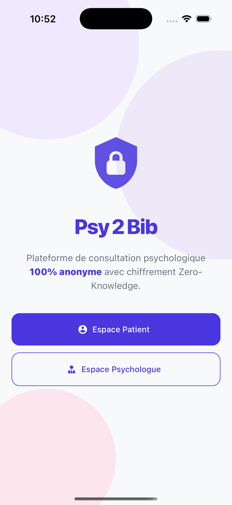
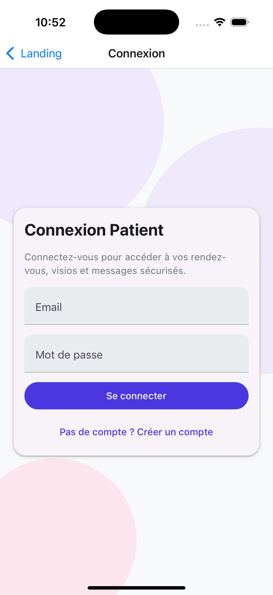
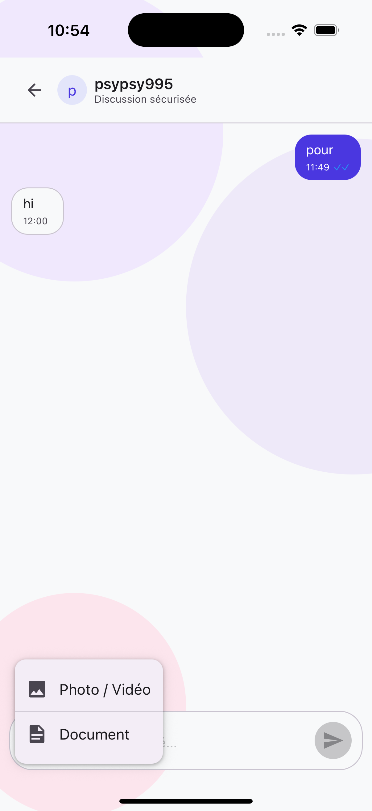
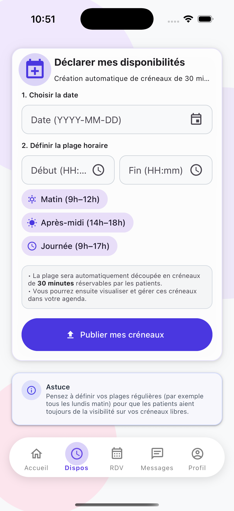

# Psy2Bib Mobile

> Application mobile de téléconsultation psychologique sécurisée avec chiffrement Zero-Knowledge

[](https://reactnative.dev/)
[](https://expo.dev/)
[](https://www.typescriptlang.org/)

## Captures d'écran
<div align="center">
  
  
  
</div>
<div align="center">
  
  
</div>

## Table des matières

- [Vue d'ensemble](#-vue-densemble)
- [Fonctionnalités](#-fonctionnalités)
- [Architecture technique](#-architecture-technique)
- [Sécurité et confidentialité](#-sécurité-et-confidentialité)
- [Installation](#-installation)
- [Configuration](#-configuration)
- [Développement](#-développement)
- [Build et déploiement](#-build-et-déploiement)
- [API Backend](#-api-backend)
- [Dépannage](#-dépannage)

## Vue d'ensemble

Psy2Bib Mobile est une application de téléconsultation psychologique conçue avec un niveau de sécurité maximal pour protéger les données de santé sensibles. L'application implémente une architecture **Zero-Knowledge** garantissant que les données médicales des patients ne sont jamais accessibles en clair au backend.

### Objectifs principaux

- **Confidentialité maximale** : Chiffrement de bout en bout des données patients
- **Conformité RGPD** : Gestion stricte des données personnelles de santé
- **Expérience utilisateur optimale** : Interface intuitive pour patients et psychologues
- **Sécurité renforcée** : Authentification robuste et protection des communications

### Public cible

- **Patients** : Recherche de psychologues, prise de rendez-vous, consultation sécurisée
- **Psychologues** : Gestion de planning, suivi des patients, téléconsultations

## Fonctionnalités

### Parcours Patient

#### Authentification et sécurité
- Inscription avec hash Argon2id calculé côté client
- Connexion sécurisée sans transmission du mot de passe en clair
- Gestion automatique des sessions avec refresh token

#### Gestion du profil
- Profil personnel entièrement chiffrés (Zero-Knowledge)
- Édition locale avec synchronisation chiffrée
- Historique médical protégé par chiffrement AES-GCM

#### Recherche et réservation
- Recherche multicritère de psychologues (spécialités, langues, localisation)
- Consultation des profils publics détaillés
- Réservation de rendez-vous sur les créneaux disponibles
- Annulation et replanification simplifiées

#### Communication
- Messagerie chiffrée de bout en bout avec le psychologue
- Envoi de pièces jointes sécurisées
- Notifications en temps réel

#### Tableau de bord
- Vue d'ensemble des rendez-vous à venir
- Statistiques de suivi personnalisées
- Calendrier intégré des consultations

### Parcours Psychologue

#### Profil professionnel
- Profil public personnalisable (description, photo, tarifs)
- Gestion des spécialités et langues pratiquées
- Contrôle de la visibilité du profil

#### Gestion de planning
- Création et suppression de créneaux de disponibilité
- Calendrier unifié (rendez-vous, disponibilités, tâches)
- Vue journalière, hebdomadaire et mensuelle

#### Gestion des rendez-vous
- Confirmation ou refus des demandes de rendez-vous
- Suivi de l'état des consultations
- Gestion des annulations et reports

#### Organisation du travail
- Système de tâches personnelles
- Création, édition et suppression de tâches
- Marquage des tâches terminées
- Intégration dans le calendrier

#### Communication
- Messagerie sécurisée avec chaque patient
- Gestion des pièces jointes chiffrées
- Compteur de messages non lus

### Fonctionnalités communes

- Navigation adaptative selon le rôle utilisateur
- Thème Material Design 3 cohérent
- Mode hors ligne avec synchronisation différée
- Stockage sécurisé des tokens d'authentification
- Rafraîchissement automatique des sessions
- Support multilingue (préparé)

## Architecture technique

### Stack technologique

| Composant | Technologie | Version | Rôle |
|-----------|-------------|---------|------|
| **Framework mobile** | React Native | 0.76 | Base de l'application cross-platform |
| **SDK** | Expo | 52 | Toolchain et modules natifs |
| **Langage** | TypeScript | 5.3+ | Type safety et développement robuste |
| **Navigation** | React Navigation | 7.x | Gestion des écrans et flux utilisateur |
| **UI Kit** | React Native Paper | 5.x | Composants Material Design 3 |
| **HTTP Client** | Axios | 1.x | Requêtes API avec interceptors |
| **Cryptographie** | @noble/hashes, @noble/ciphers | - | Algorithmes de chiffrement |
| **Stockage sécurisé** | expo-secure-store | - | Keychain/Keystore natif |

### Choix architecturaux

#### React Native + Expo
- **Avantages** : Codebase unique iOS/Android, hot reload, OTA updates
- **Modules natifs** : Gérés par Expo (camera, secure storage, crypto)
- **Performance** : New Architecture Fabric activée

#### TypeScript
- Typage strict pour réduire les erreurs runtime
- Autocomplétion et refactoring facilités
- Documentation implicite du code

#### React Navigation
- Stack navigators conditionnels par rôle
- Deep linking prêt pour les notifications
- État de navigation persisté

#### Axios centralisé
- Interceptors pour injection automatique des tokens
- Gestion transparente du refresh token
- Retry logic sur erreurs réseau

## Sécurité et confidentialité

### Niveau 1 : Authentification robuste

#### Hash côté client (Argon2id)
```typescript
Paramètres :
- Algorithme : Argon2id
- Mémoire : 64 MB
- Itérations : 3
- Parallélisme : 1
- Sortie : 32 bytes
```

#### Génération du salt
```typescript
Salt déterministe = SHA256("psy2bib:" + email)
Hash = Argon2id(password, salt, params)
```

**Avantages** :
- Le backend ne reçoit jamais le mot de passe en clair
- Salt déterministe permet la connexion sans stockage local
- Résistance aux attaques par force brute

#### Gestion des tokens JWT
- **Access token** : Durée de vie courte (15 min)
- **Refresh token** : Durée de vie longue (7 jours)
- Stockage dans SecureStore (Keychain iOS / Keystore Android)
- Rotation automatique via interceptor Axios

### Niveau 2 : Vault patient (Zero-Knowledge)

#### Architecture du vault

```
┌─────────────────────────────────────────────────┐
│  Mot de passe patient (côté client uniquement) │
└────────────────┬────────────────────────────────┘
                 │
                 ▼
         ┌───────────────┐
         │  Argon2id KDF │
         └───────┬───────┘
                 │
                 ▼
         ┌───────────────┐
         │   Master Key  │ (32 bytes, stockée localement)
         └───────┬───────┘
                 │
                 ▼
         ┌───────────────┐
         │   AES-256-GCM │
         └───────┬───────┘
                 │
                 ▼
         ┌───────────────┐
         │ Données chiffrées │ (stockées sur serveur)
         └───────────────┘
```

#### Processus de chiffrement

1. **Initialisation** (première utilisation)
   - Génération d'un salt aléatoire (16 bytes)
   - Dérivation de la master key via Argon2id
   - Stockage de la master key dans SecureStore

2. **Chiffrement des données**
   - Génération d'un IV unique (12 bytes)
   - Chiffrement AES-256-GCM avec la master key
   - Format final : `{ iv: string, data: string }`

3. **Stockage**
   - Master key : SecureStore (local, jamais envoyée)
   - Données chiffrées : Backend (JSON)
   - Salt : Backend (nécessaire pour la dérivation)

#### Garanties Zero-Knowledge

Le backend ne connaît jamais :
- Le mot de passe du patient
- La master key de chiffrement
- Le contenu des données médicales en clair

Même en cas de compromission du serveur :
- Les données restent illisibles sans le mot de passe
- Aucune clé de déchiffrement n'est stockée côté serveur

### Niveau 3 : Messagerie chiffrée de bout en bout

#### Dérivation de la clé de conversation

```typescript
conversationKey = Argon2id(
  password: userId1 + userId2 (sorted),
  salt: "psy2bib-chat-v1",
  params: { m: 4MB, t: 1, p: 1 }
)
```

#### Chiffrement des messages
- Algorithme : AES-256-GCM
- IV unique par message (12 bytes)
- Tag d'authentification pour détecter les modifications

#### Pièces jointes
- Chiffrement avant upload
- Déchiffrement à la réception
- Suppression automatique des fichiers temporaires

**Limitations actuelles** :
- Clé de conversation statique (pas de rotation)
- Pas de forward secrecy (Signal Protocol envisagé)

### Mesures de sécurité additionnelles

- **Certificate pinning** : Prévu pour éviter les attaques MITM
- **Obfuscation du code** : Activée en production
- **Détection de root/jailbreak** : Prévu pour bloquer les devices compromis
- **Timeout de session** : Déconnexion automatique après inactivité
- **Wipe des données sensibles** : Suppression locale en cas de déconnexion

## Installation

### Prérequis

- **Node.js** : >= 18.x LTS
- **npm** ou **yarn** : Dernière version stable
- **Expo CLI** : Installé via npx (pas besoin d'installation globale)
- **Git** : Pour cloner le repository

#### Environnements de développement (optionnels)

**Pour iOS :**
- macOS avec Xcode 14+
- iOS Simulator ou iPhone physique

**Pour Android :**
- Android Studio avec SDK 33+
- Émulateur Android ou appareil physique

### Installation des dépendances

```bash
# Cloner le repository
git clone https://github.com/Psy2Bib/Psy2Bib-Mobile
cd psy2bib-mobile

# Installer les dépendances
npm install

# Ou avec yarn
yarn install
```

### Vérification de l'installation

```bash
# Vérifier que tout est bien configuré
npx expo-doctor

# Lister les devices disponibles
npx expo run:android --list-devices
npx expo run:ios --list-devices
```

## Configuration

### Variables d'environnement

Créer un fichier `.env` à la racine du projet :

```bash
# API Configuration
API_BASE_URL=https://api.psy2bib.com
API_TIMEOUT=30000

# Environnement
NODE_ENV=development

# Feature flags
ENABLE_ANALYTICS=false
ENABLE_CRASH_REPORTING=false
```

### Configuration de l'API

Éditer `src/api/client.ts` pour pointer vers votre backend :

```typescript
const API_BASE = __DEV__ 
  ? Platform.select({
      ios: 'http://localhost:4000',
      android: 'http://10.0.2.2:4000',
      default: 'http://localhost:4000'
    })
  : 'https://api.psy2bib.com';
```

**URLs locales courantes :**

| Environnement | URL |
|---------------|-----|
| iOS Simulator | `http://localhost:4000` |
| Android Emulator | `http://10.0.2.2:4000` |
| Appareil physique | `http://<IP_LAN>:4000` |
| Tunnel Expo | `https://<tunnel-id>.ngrok.io` |

### Configuration Expo (app.json)

Les paramètres principaux sont définis dans `app.json` :

```json
{
  "expo": {
    "name": "Psy2Bib",
    "slug": "psy2bib-mobile",
    "version": "1.0.0",
    "scheme": "psy2bib",
    "platforms": ["ios", "android"],
    "newArchEnabled": true,
    "ios": {
      "bundleIdentifier": "com.psy2bib.app",
      "supportsTablet": true
    },
    "android": {
      "package": "com.psy2bib.app",
      "adaptiveIcon": {
        "foregroundImage": "./assets/adaptive-icon.png"
      }
    }
  }
}
```

### Permissions

Les permissions suivantes sont configurées :

- **Camera** : Prévu pour futures visioconférences
- **Microphone** : Prévu pour futures visioconférences  
- **Notifications** : Alertes de rendez-vous et messages
- **Storage** : Gestion des pièces jointes

## 💻 Développement

### Démarrer le serveur de développement

```bash
# Démarrer Expo
npm start

# Ou avec options
npm start -- --clear  # Vider le cache
npm start -- --tunnel # Exposer via tunnel (utile pour tests sur appareil physique)
```

### Lancer sur un appareil

```bash
# iOS
npm run ios
# ou cibler un simulateur spécifique
npm run ios -- --simulator="iPhone 15 Pro"

# Android
npm run android
# ou cibler un device spécifique
npm run android -- --device <device-id>

# Web (développement uniquement)
npm run web
```

### Scripts disponibles

| Script | Description |
|--------|-------------|
| `npm start` | Démarrer le serveur de développement |
| `npm run android` | Lancer sur Android |
| `npm run ios` | Lancer sur iOS |
| `npm run web` | Lancer sur le web |
| `npm run lint` | Vérifier le code avec ESLint |
| `npm run type-check` | Vérifier les types TypeScript |
| `npm test` | Lancer les tests unitaires |
| `npm run test:e2e` | Lancer les tests end-to-end |

### Outils de développement

#### React Native Debugger
```bash
# Installer (macOS)
brew install --cask react-native-debugger

# Ou télécharger depuis GitHub
# https://github.com/jhen0409/react-native-debugger/releases
```

#### Flipper (outil de débogage officiel)
```bash
# Installer
brew install --cask flipper

# Lancer Flipper et connecter l'app
```

### Bonnes pratiques

- Utiliser TypeScript strict mode
- Suivre les conventions de nommage (PascalCase pour composants, camelCase pour fonctions)
- Créer des composants réutilisables dans `src/components`
- Typer toutes les props et states
- Utiliser les hooks personnalisés pour la logique métier
- Documenter les fonctions complexes avec JSDoc
- Tester les composants critiques

## Build et déploiement

### Configuration EAS

Les profils de build sont définis dans `eas.json` :

```json
{
  "build": {
    "development": {
      "developmentClient": true,
      "distribution": "internal"
    },
    "preview": {
      "distribution": "internal",
      "android": {
        "buildType": "apk"
      }
    },
    "production": {
      "autoIncrement": true
    }
  }
}
```

### Builds de développement

```bash
# Android APK pour tests internes
eas build --profile development --platform android

# iOS pour TestFlight interne
eas build --profile development --platform ios
```

### Builds de preview

```bash
# Android APK pour beta testeurs
eas build --profile preview --platform android

# iOS pour TestFlight externe
eas build --profile preview --platform ios
```

### Builds de production

```bash
# Android pour Google Play Store
eas build --profile production --platform android

# iOS pour App Store
eas build --profile production --platform ios

# Les deux en une commande
eas build --profile production --platform all
```

### Soumission aux stores

```bash
# Soumettre à Google Play
eas submit --platform android

# Soumettre à l'App Store
eas submit --platform ios
```

### Over-The-Air (OTA) Updates

```bash
# Publier une mise à jour OTA
eas update --branch production --message "Fix bug XYZ"

# Publier sur plusieurs branches
eas update --branch staging,production
```


## 🔌 API Backend

### Endpoints principaux

#### Authentification

| Méthode | Endpoint | Description | Auth |
|---------|----------|-------------|------|
| POST | `/auth/register` | Inscription (patient ou psy) | Non |
| POST | `/auth/login` | Connexion | Non |
| POST | `/auth/refresh` | Rafraîchir l'access token | Refresh token |
| POST | `/auth/logout` | Déconnexion | Oui |

#### Patients

| Méthode | Endpoint | Description | Auth |
|---------|----------|-------------|------|
| GET | `/patients/me` | Profil patient chiffré | Oui |
| PUT | `/patients/me` | Mise à jour du profil | Oui |
| GET | `/patients/me/vault` | Récupérer le vault | Oui |
| PUT | `/patients/me/vault` | Mettre à jour le vault | Oui |

#### Psychologues

| Méthode | Endpoint | Description | Auth |
|---------|----------|-------------|------|
| GET | `/psychologists` | Liste des psychologues | Optionnel |
| GET | `/psychologists/:id` | Profil public d'un psy | Optionnel |
| GET | `/psychologists/me` | Profil complet du psy connecté | Oui |
| PUT | `/psychologists/me` | Mise à jour du profil | Oui |
| GET | `/psychologists/:id/availabilities` | Disponibilités d'un psy | Optionnel |

#### Disponibilités (Psychologue)

| Méthode | Endpoint | Description | Auth |
|---------|----------|-------------|------|
| GET | `/psy/availabilities` | Mes disponibilités | Oui |
| POST | `/psy/availabilities` | Créer une disponibilité | Oui |
| DELETE | `/psy/availabilities/:id` | Supprimer une disponibilité | Oui |

#### Rendez-vous

| Méthode | Endpoint | Description | Auth |
|---------|----------|-------------|------|
| POST | `/appointments/book` | Réserver un rendez-vous | Oui |
| GET | `/appointments/my` | Mes rendez-vous (patient) | Oui |
| GET | `/psy/appointments` | Mes rendez-vous (psy) | Oui |
| PATCH | `/appointments/:id/confirm` | Confirmer un RDV (psy) | Oui |
| PATCH | `/appointments/:id/cancel` | Annuler un RDV | Oui |

#### Calendrier

| Méthode | Endpoint | Description | Auth |
|---------|----------|-------------|------|
| GET | `/calendar/psy` | Calendrier unifié (psy) | Oui |
| GET | `/calendar/patient` | Calendrier (patient) | Oui |

#### Tâches (Psychologue)

| Méthode | Endpoint | Description | Auth |
|---------|----------|-------------|------|
| GET | `/psy-tasks` | Liste des tâches | Oui |
| POST | `/psy-tasks` | Créer une tâche | Oui |
| PUT | `/psy-tasks/:id` | Modifier une tâche | Oui |
| DELETE | `/psy-tasks/:id` | Supprimer une tâche | Oui |

#### Chat

| Méthode | Endpoint | Description | Auth |
|---------|----------|-------------|------|
| GET | `/chat/threads` | Liste des conversations | Oui |
| GET | `/chat/conversation/:id` | Messages d'une conversation | Oui |
| POST | `/chat/send` | Envoyer un message | Oui |
| PATCH | `/chat/conversation/:id/read` | Marquer comme lu | Oui |
| GET | `/chat/unread/count` | Nombre de messages non lus | Oui |
| POST | `/chat/attachment` | Upload pièce jointe chiffrée | Oui |
| GET | `/chat/attachment/:id` | Télécharger pièce jointe | Oui |

### Formats de requête/réponse

#### Exemple : Inscription patient

```typescript
// POST /auth/register
{
  "email": "patient@example.com",
  "passwordHash": "argon2id$v=19$m=65536,t=3,p=1$...",
  "role": "patient",
  "firstName": "Jean",
  "lastName": "Dupont"
}

// Réponse 201
{
  "user": {
    "id": "uuid-1234",
    "email": "patient@example.com",
    "role": "patient"
  },
  "accessToken": "eyJhbGc...",
  "refreshToken": "eyJhbGc..."
}
```


### Codes d'erreur

| Code | Signification | Action |
|------|---------------|--------|
| 400 | Bad Request | Vérifier les paramètres |
| 401 | Unauthorized | Rafraîchir le token ou se reconnecter |
| 403 | Forbidden | Permissions insuffisantes |
| 404 | Not Found | Ressource inexistante |
| 409 | Conflict | Créneau déjà réservé, email déjà utilisé |
| 429 | Too Many Requests | Rate limiting, réessayer plus tard |
| 500 | Internal Server Error | Contacter le support |

## 🔧 Dépannage

### Problèmes courants

#### Erreur de connexion au backend

**Symptôme** : `Network Error` ou `ECONNREFUSED`

**Solutions** :
```bash
# 1. Vérifier que le backend tourne
curl http://localhost:4000/api

# 2. Vérifier l'URL dans client.ts
# iOS Simulator -> localhost:4000
# Android Emulator -> 10.0.2.2:4000

# 3. Utiliser un tunnel si nécessaire
npm start -- --tunnel
```

#### Erreur 401 en boucle

**Symptôme** : Déconnexion répétée même après connexion

**Solutions** :
```bash
# 1. Vérifier l'endpoint de refresh
# GET /auth/refresh avec le refresh token

# 2. Vérifier la validité des tokens
# Dans src/hooks/useAuth.ts

# 3. Vider le cache
npm start -- --clear
```

#### Données patient illisibles

**Symptôme** : Erreur de déchiffrement ou données corrompues

**Solutions** :
- Vérifier que le mot de passe et l'email sont identiques à l'inscription
- Vérifier que le salt n'a pas changé
- En dernier recours, supprimer le vault et recréer le profil

#### Cache Expo problématique

```bash
# Vider complètement le cache
npx expo start -c

# Ou manuellement
rm -rf node_modules .expo .expo-shared
npm install
```

#### Problèmes de build iOS

```bash
# Nettoyer le cache iOS
cd ios && pod install --repo-update
cd .. && npm run ios

# Si problème persiste
cd ios && pod deintegrate && pod install
```

#### Problèmes de build Android

```bash
# Nettoyer les caches Gradle
cd android && ./gradlew clean
cd .. && npm run android

# Vider le cache Gradle global
rm -rf ~/.gradle/caches/
```